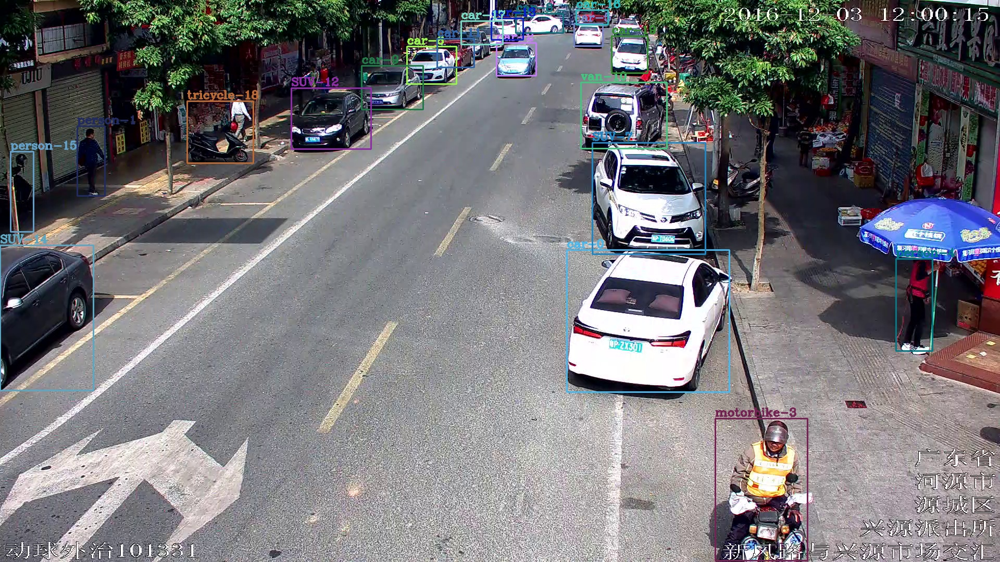

#  **Object Tracking with TensorRT**

## **Introduction**

This is an implementation for object tracking in cplusplus code. The object detector uses [yolov5s](https://github.com/ultralytics/yolov5/blob/master/models/yolov5s.yaml) model. The idea of [deepsort](https://arxiv.org/abs/1703.07402) is adopted in object tracking. The implementation of [sort](https://arxiv.org/abs/1602.00763) refers to the [sort-cpp](https://github.com/mcximing/sort-cpp). When extracting object features, it is extracted through the [fast-reid](https://github.com/JDAI-CV/fast-reid) trained model, and the person ReID uses [mobilenetv2](https://github.com/JDAI-CV/fast-reid/blob/master/fastreid/modeling/backbones/mobilenet.py). The purpose of using these lightweight models is to ensure the real-time efficiency of video processing. The model inference base on [TensorRT](https://developer.nvidia.com/zh-cn/tensorrt) engine. 

## **How to run?**

**0. Build environments**

The TenosrRT environments build from Dockerfile, run with the following command.

```bash
docker build -t tensorrt_tracker:0.1.0_rc .
```

Following yolov5 and fast-reid requirements file to install their depends packages. 

**1. Transform PyTorch weights to ONNX**

- **Transform yolov5 weights**

Use this [yolov5 repo](https://github.com/linghu8812/yolov5) to transform yolov5 *.pt weights to ONNX models. Run the following command
```
git clone https://github.com/linghu8812/yolov5.git
python3 export.py ---weights weights/yolov5s.pt --batch-size 1 --imgsz 640 --include onnx --simplify
```
A pretrained yolov5 ***ONNX***  detection model can be downloaded form here, link: [https://pan.baidu.com/s/1RUz7Xk78lvKCeZNk_BBvoQ](https://pan.baidu.com/s/1RUz7Xk78lvKCeZNk_BBvoQ), code: *jung*. download this model and put it to the `weights` folder.

- **Transform fastreid weights**

Use official [fast-reid](https://github.com/JDAI-CV/fast-reid) to transform PyTorch weights to ONNX model. Run the following command
```
https://github.com/JDAI-CV/fast-reid.git
python3 tools/deploy/onnx_export.py --config-file configs/Market1501/mgn_R50-ibn.yml --name mgn_R50-ibn --output outputs/onnx_model --batch-size 32 --opts MODEL.WEIGHTS market_mgn_R50-ibn.pth
```
A pretrained fast-reid ***ONNX***  detection model can be downloaded form here, link: [https://pan.baidu.com/s/19TuHxxuVYLBzie5_Vu0cCQ](https://pan.baidu.com/s/19TuHxxuVYLBzie5_Vu0cCQ), code: *1e35*. download this model and put it to the `weights` folder.

**2. Get video for inference ready**

Put video file for inference to `samples` folder. Here is a video demo for inference can be used: [https://pan.baidu.com/s/1Yyh1lwmzNl_gjvNz9EVI5w](https://pan.baidu.com/s/1Yyh1lwmzNl_gjvNz9EVI5w), code: *fpi0*.

**3. Build project**

Run the following command
```
git clone git@github.com:linghu8812/tensorrt_tracker.git
mkdir build && cd build
cmake ..
make -j
```

**4. Run project**

Run the following command
```
./object_tracker ../configs/config.yaml ../samples/test.mpg
```

results demo:

[](https://www.bilibili.com/video/BV1qg411K74p?t=0.0)

## **Reference**

- **yolov5:** [https://github.com/ultralytics/yolov5](https://github.com/ultralytics/yolov5)
- **FastReID: A Pytorch Toolbox for General Instance Re-identification:** [https://arxiv.org/abs/2006.02631](https://arxiv.org/abs/2006.02631)
- **fast-reid:** [https://github.com/JDAI-CV/fast-reid](https://github.com/JDAI-CV/fast-reid)
- **Simple Online and Realtime Tracking:** [https://arxiv.org/abs/1602.00763](https://arxiv.org/abs/1602.00763)
- **sort-cpp:** [https://github.com/mcximing/sort-cpp](https://github.com/mcximing/sort-cpp)
- **Simple Online and Realtime Tracking with a Deep Association Metric:** [https://arxiv.org/abs/1703.07402](https://arxiv.org/abs/1703.07402)
- **tensorrt_inference:** [https://github.com/linghu8812/tensorrt_inference](https://github.com/linghu8812/tensorrt_inference)
